# KYK Yemekhane Simülasyon Analiz Platformu

Arena simülasyon çıktıları, istatistiksel uygunluk testleri ve darboğaz tespiti için geliştirilmiş web tabanlı analiz platformu.

> Hedef: Pik saatlerde oluşan kuyruk ve kapasite problemlerini sayısal olarak görünür kılmak, hızlı aksiyon önerileri üretmek.

---

## İçindekiler

- [Proje Özeti](#proje-özeti)
- [Görsel Özet](#görsel-özet)
- [Temel Özellikler](#temel-özellikler)
- [Problem ve İş Kapsamı](#problem-ve-iş-kapsamı)
- [Sistem Mimarisi](#sistem-mimarisi)
- [Analiz Akışı](#analiz-akışı)
- [Arena Modül Haritası](#arena-modül-haritası)
- [İstatistiksel Testler](#istatistiksel-testler)
- [İstatistiksel Görseller](#istatistiksel-görseller)
- [Web Arayüz Ekranları](#web-arayüz-ekranları)
- [Sonuçlar ve İyileşme](#sonuçlar-ve-iyileşme)
- [Darboğaz Tespit Kuralları](#darboğaz-tespit-kuralları)
- [Kurulum](#kurulum)
- [Hızlı Başlangıç](#hızlı-başlangıç)
- [API Referansı](#api-referansı)
- [Dosya Yapısı](#dosya-yapısı)
- [Veri Sözleşmeleri](#veri-sözleşmeleri)
- [Sunum ve Dokümantasyon Entegrasyonu](#sunum-ve-dokümantasyon-entegrasyonu)
- [Yol Haritası](#yol-haritası)
- [Katkı ve Geliştirme Notları](#katkı-ve-geliştirme-notları)

---

## Proje Özeti

Bu proje, KYK yemekhane senaryosunda **yüksek talep / sınırlı kapasite** kaynaklı darboğazları analiz etmek için geliştirilmiştir.  
Özellikle şu sorulara cevap verir:

- Hangi hizmet noktası darboğaz yaratıyor?
- Kuyruk birikimi süre bazlı mı, kapasite bazlı mı?
- Dağılım varsayımları (üstel/normal) veriye uyuyor mu?
- Hangi operasyonel aksiyon en hızlı iyileştirmeyi sağlar?

---

## Görsel Özet

### Model ve Süreç Diyagramları

KYK akışını hızlıca anlamak için:


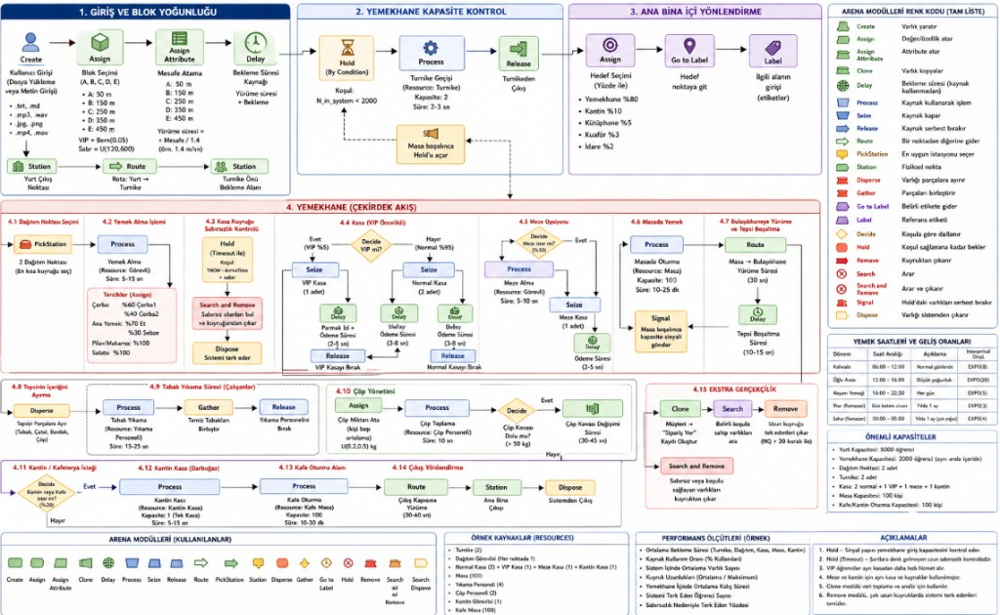

### Pipeline ve Analiz Akışı

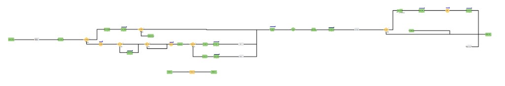


---

## Temel Özellikler

- Arena `.out` dosyasını otomatik parse edip metrik JSON üretimi
- Excel verisinden otomatik Ki-kare ve KS test raporu
- Kaynak/kuyruk/throughput tabanlı darboğaz tespiti
- Kural tabanlı iyileştirme önerileri (kapasite, personel, senkronizasyon)
- Tek ekrandan rapor yenileme ve sonuç yorumlama

---

## Problem ve İş Kapsamı

Simülasyon senaryosunda gözlenen ana problem, pik saatlerde sistemin gelen talebi tam karşılayamamasıdır.  
Bu durum:

- uzun kuyruk oluşumu,
- servis hızında düşüş,
- personel yükünde dengesizlik,
- öğrencilerin sistemde birikmesi
sonuçlarını doğurur.

Platform, bu problemi üç katmanda ele alır:

1. **Dağılım doğrulama katmanı** (Ki-kare / KS)
2. **Akış performansı katmanı** (WIP, throughput, bekleme)
3. **Operasyon katmanı** (kaynak kullanımı, hat kapasitesi, senkronizasyon)

---

## Sistem Mimarisi

### Backend

- `FastAPI` tabanlı API servisi: `backend/app.py`
- İstatistik ve karar scriptleri: `scripts/*.py`

### Frontend

- Statik arayüz: `web/index.html`
- Sunucu entegrasyonları: `web/report-runner.js`
- Görsel raporlar: `web/stat-tests.js`, `web/stat-advisor.js`

### Veri Katmanı

Üretilen temel artefaktlar:

- `web/data/arena-metrics.json`
- `web/data/stat-fit-tests.json`
- `web/data/bottleneck-report.json`

---

## Analiz Akışı

```text
Arena .out / Excel / JSON
        ↓
Ön işleme + parser
        ↓
Ki-kare + KS testleri
        ↓
Darboğaz kural motoru
        ↓
Öneri üretimi
        ↓
Web panelde raporlama
```

### Mantıklı Akış 

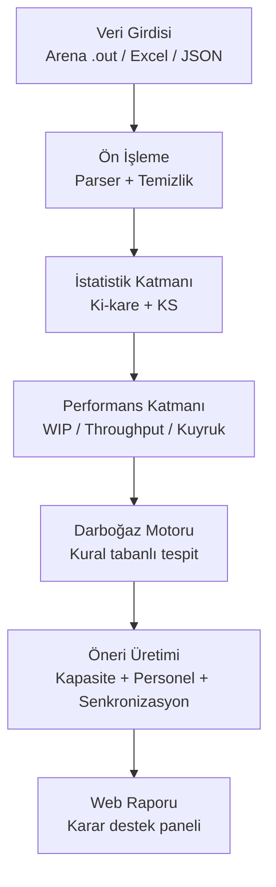

Uygulamada desteklenen çalışma modları:

- **Tam Rapor**: Excel + metrik + test + darboğaz
- **Sadece Darboğaz**: mevcut metriklerden hızlı öneri
- **.out Analizi**: Arena çıktısını direkt yükleyerek metrik + öneri

---

## Arena Modül Haritası

Sunum ve model uyumluluğu için modüller bu şekilde eşleştirilir:

- `Create`: öğrenci geliş yoğunluğu (pik saat yükleme)
- `Assign / Assign Attribute`: bireysel profil (tercih, hız, bütçe, sabır)
- `Decide`: kimlik doğrulama, stok ve yönlendirme kararları
- `Process`: servis adımı ve işlem süresi
- `Seize / Release`: kaynak alma-bırakma (personel, masa/sandalye)
- `Delay`: servis/yürüme/zaman tabanlı gecikmeler
- `Hold / Signal`: stok ve senkronizasyon tetikleme
- `PickStation / Station / Route`: hat seçimi ve akış dengeleme
- `Record`: performans ölçütlerinin toplanması
- `Dispose`: sistemden çıkış

---

## İstatistiksel Testler

### Ki-kare Testleri

- Uygunluk testi: kategorik dağılımın hipotezle karşılaştırılması
- Bağımsızlık testi: iki kategorik değişken arasındaki ilişkinin incelenmesi
- Örnek: `Yemek_Tercihi`, `Butce x Yemek_Tercihi`, `Sosyal_Mod x Yemek_Tercihi`

### Kolmogorov-Smirnov Testleri

- Sürekli değişkenlerin teorik dağılıma uyumu
- Örnek:
  - `Gelis_Suresi_Dk ~ Exponential`
  - `TC_Giris_Dk ~ Normal`
  - `Yemek_Yeme_Dk ~ Normal`

> Not: Parametreler veriden tahmin edildiğinde klasik KS p-değer yorumunda dikkat gerekir.

---

## İstatistiksel Görseller

### 1) Geliş süresi ham dağılım görünümü

Geliş sürelerinin yayılımını ve yoğunluk bölgelerini gösterir.

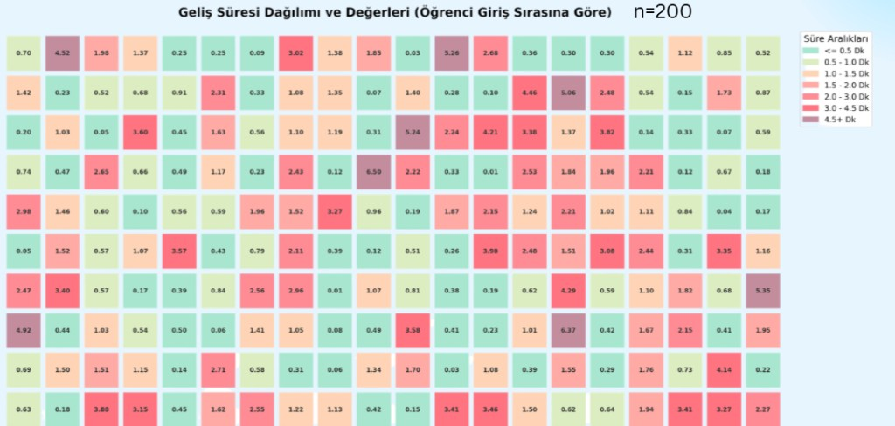

### 2) Ki-kare uygunluk testi (karar şeması)

Hesaplanan istatistik ile kritik sınırın karşılaştırmasını görselleştirir.

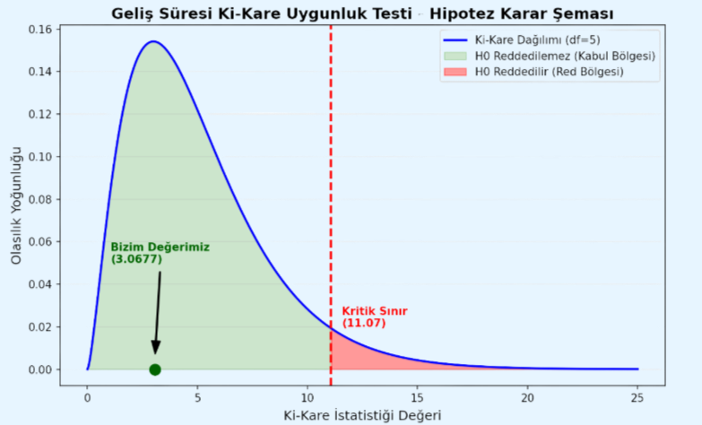

### 3) Ki-kare tablo + formül adımları

Aralık, gözlenen/beklenen frekans ve test istatistiği hesabını özetler.

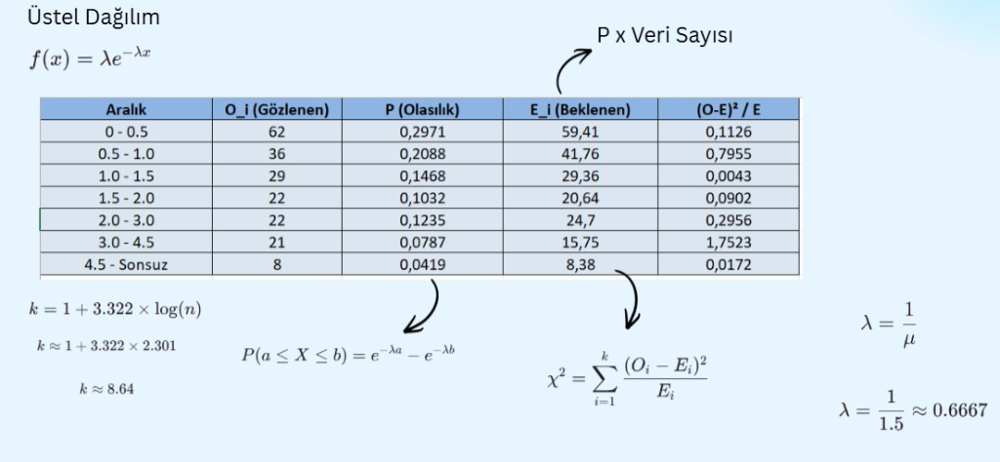

### 4) K-S testi hazırlık (sıralı görünüm)

Hız çarpanı verisinin küçükten büyüğe sıralanmış test hazırlık adımı.

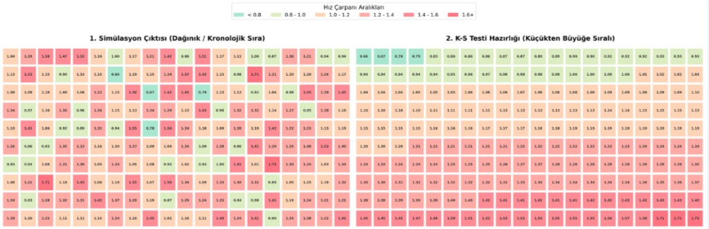

### 5) K-S tablo hesabı (F0, Fz, farklar)

Maksimum sapma değerine giden hesaplama adımlarını gösterir.

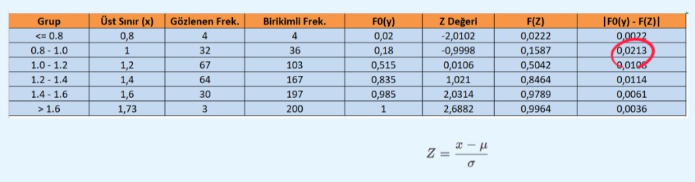

### 6) K-S karar şeması

Bulunan `Dmax` ile kritik sınır karşılaştırmasını verir.

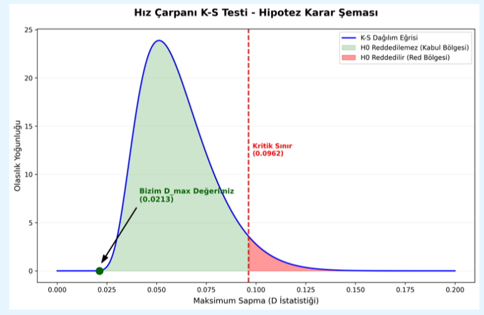

---

## Web Arayüz Ekranları

Bu bölümde platformun web tarafındaki gerçek ekran görüntüleri yer alır.

### Ana ekran (hero ve hızlı özet)

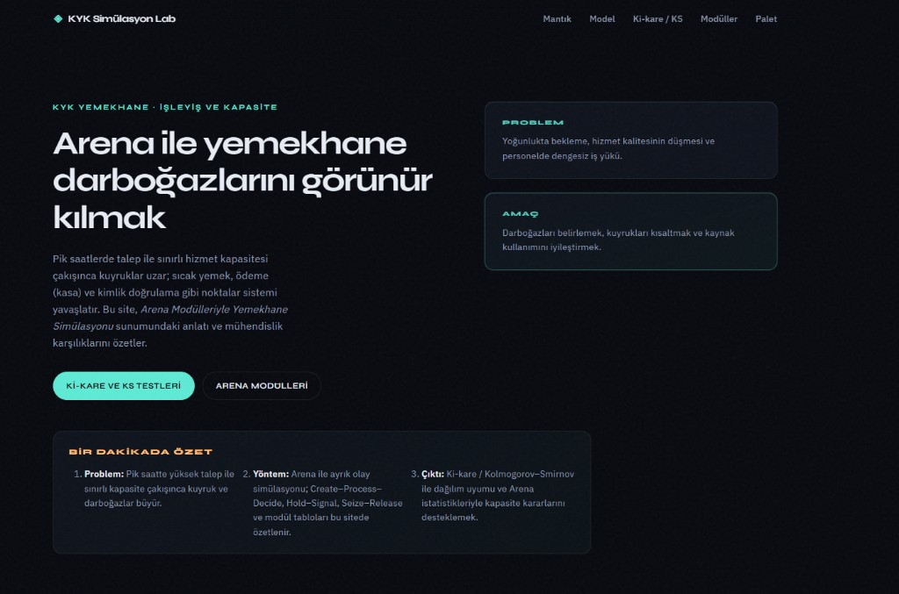

### Kritik darboğaz tablosu ve açıklama paneli

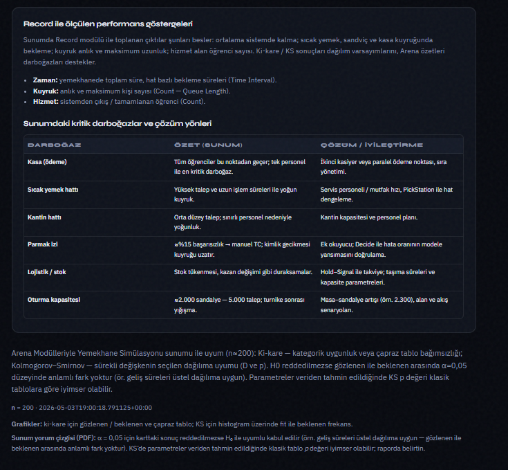

### Ki-kare kartları

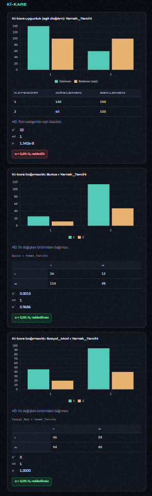

### Kolmogorov-Smirnov kartları

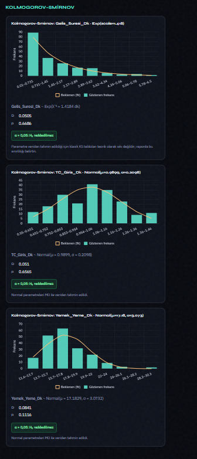

### Raporu yenile paneli (Excel/JSON/.out)

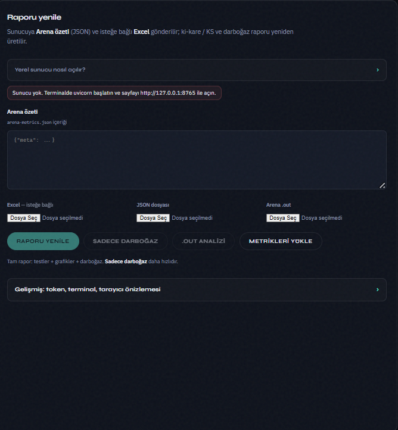

---

## Sonuçlar ve İyileşme

Bu görsel, model düzeltmesi öncesi ve sonrası kuyruk davranışını karşılaştırır.

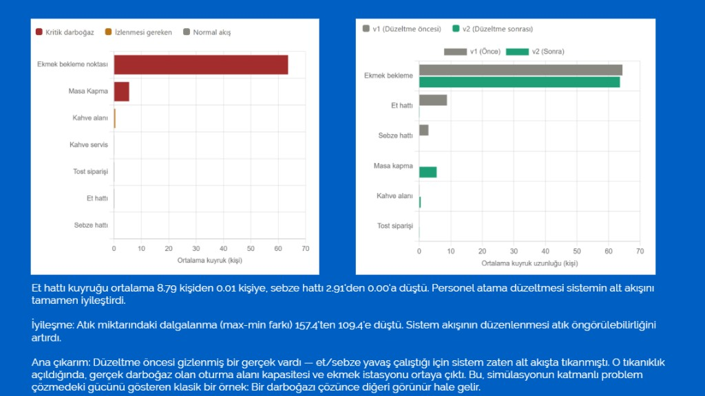

Çıkarım:

- Et hattı kuyruğu yaklaşık `8.79` kişiden `0.01` kişiye düştü.
- Sebze hattı kuyruğu yaklaşık `2.91` kişiden `0.00` seviyesine indi.
- Personel atama ve akış düzeltmesi alt akışı iyileştirdi.
- Alt akış açılınca gerçek darboğazın oturma kapasitesi ve ekmek bekleme hattı olduğu daha net görünür oldu.

Bu durum, simülasyonda klasik bir katmanlı iyileştirme etkisini gösterir: bir darboğaz çözüldüğünde bir sonraki darboğaz görünür hale gelir.

---

## Darboğaz Tespit Kuralları

Kural motoru aşağıdaki sinyalleri değerlendirir:

- kritik kaynak doluluğu (`utilization`)
- yüksek kuyruk ortalaması (`queue avg`)
- yüksek bekleme süresi (`queue waiting time`)
- düşük çıkış/giriş oranı (`NumberOut / NumberIn`)
- aşırı WIP birikimi

Ek kontrol:

- Kuyruk yüksek fakat kaynak kullanımı çok düşükse model bağlantı/mantık uyumsuzluğu uyarısı üretir.

---

## Kurulum

### Gereksinimler

- Python 3.10+
- `pip`

### Kurulum adımları

```bash
pip install -r requirements-backend.txt
python -m uvicorn backend.app:app --host 127.0.0.1 --port 8765
```

Arayüz:

```text
http://127.0.0.1:8765/
```

---

## Hızlı Başlangıç

1. Sunucuyu başlatın.
2. Web panelde `Raporu yenile` bölümüne gidin.
3. Aşağıdakilerden birini seçin:
   - Excel + JSON yükleyip **Raporu yenile**
   - Metrik hazırsa **Sadece darboğaz**
   - Arena raporu varsa `.out` seçip **.out analizi**
4. Çıktıları panelde inceleyin:
   - test sonuçları
   - darboğaz listesi
   - aksiyon önerileri

---

## API Referansı

### `GET /api/health`
Servis sağlık kontrolü.

### `POST /api/regenerate`
Excel ve opsiyonel metrik JSON ile tam raporu yeniden üretir.

### `POST /api/bottleneck-only`
Sadece mevcut `arena-metrics.json` üzerinden darboğaz analizi yapar.

### `POST /api/arena-out`
Arena `.out` dosyasını parse eder, metrik üretir ve darboğaz raporu çıkarır.

---

## Dosya Yapısı

```text
backend/
  app.py

scripts/
  arena_out_parser.py
  bottleneck_advisor.py
  stat_fit_tests.py
  regenerate_web_reports.py

web/
  index.html
  report-runner.js
  stat-tests.js
  stat-advisor.js
  data/
    arena-metrics.json
    stat-fit-tests.json
    bottleneck-report.json
```

---

## Veri Sözleşmeleri

### `arena-metrics.json` (özet)

- `throughput.entityNumberIn`
- `throughput.entityNumberOut`
- `resourceUtilization[]`
- `queueLengthAvg[]`
- `queueWaitingAvgHours[]`
- `wip.average / maximum / final`

### `stat-fit-tests.json` (özet)

- `chi_square[]`
- `kolmogorov_smirnov[]`
- test istatistikleri, p-value, karar alanları

### `bottleneck-report.json` (özet)

- `bottlenecks[]`
- `recommendations[]`
- `summary_lines[]`

---

## Yol Haritası

- çoklu senaryo karşılaştırma ekranı
- replikasyon bazlı güven aralığı raporları
- yarı-otomatik kapasite optimizasyon önerileri
- PDF/sunumdan otomatik özet çıkarma
- öneri motorunda puanlama (etki x maliyet)

---

## Katkı ve Geliştirme Notları

- Yeni test eklenecekse önce `scripts/stat_fit_tests.py` güncellenmeli.
- Yeni darboğaz kuralı için `scripts/bottleneck_advisor.py` içinde kural + açıklama birlikte eklenmeli.
- Frontend’de yeni aksiyon butonu gerekiyorsa `web/index.html` ve `web/report-runner.js` birlikte güncellenmeli.
